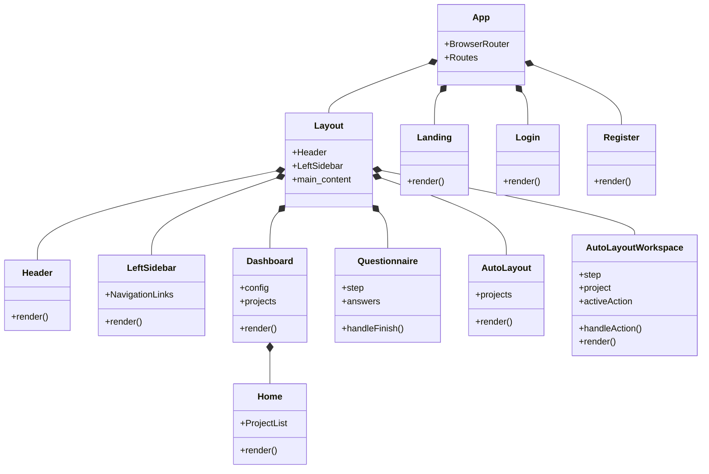

# Class Diagram (Component Tree)

```mermaid
classDiagram
    class App {
        +BrowserRouter
        +Routes
    }

    class Header {
        +render()
    }

    class LeftSidebar {
        +render()
        +NavigationLinks
    }

    class Layout {
        +Header
        +LeftSidebar
        +main_content
    }

    class Landing {
        +render()
    }

    class Login {
        +render()
    }

    class Register {
        +render()
    }

    class Dashboard {
        +config
        +projects
        +render()
    }

    class Home {
        +render()
        +ProjectList
    }

    class Questionnaire {
        +step
        +answers
        +handleFinish()
    }

    class AutoLayout {
        +projects
        +render()
    }

    class AutoLayoutWorkspace {
        +step
        +project
        +activeAction
        +handleAction()
        +render()
    }

    App *-- Layout
    App *-- Landing
    App *-- Login
    App *-- Register
    
    Layout *-- Header
    Layout *-- LeftSidebar
    
    Layout *-- Dashboard
    Layout *-- AutoLayout
    Layout *-- AutoLayoutWorkspace
    Layout *-- Questionnaire

    Dashboard *-- Home

```
