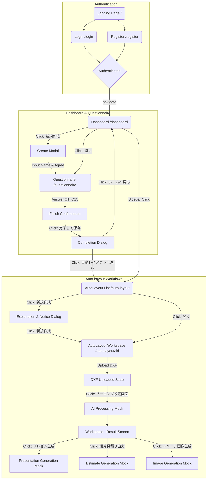

# Flow Diagram (UI and Workflow)

```mermaid
flowchart TD
    subgraph auth [Authentication]
        A(Landing Page /) --> B(Login /login)
        A --> C(Register /register)
        B --> D{Authenticated}
        C --> D
    end

    subgraph dashboard [Dashboard & Questionnaire]
        D -->|navigate| E(Dashboard /dashboard)
        
        E -->|Click: 新規作成| F[Create Modal]
        F -->|Input Name & Agree| G(Questionnaire /questionnaire)
        E -->|Click: 開く| G
        
        G -->|Answer Q1, Q15| H[Finish Confirmation]
        H -->|Click: 完了して保存| I[Completion Dialog]
    end

    subgraph autolayout [Auto Layout Workflows]
        I -->|Click: ホームへ戻る| E
        I -->|Click: 自動レイアウトへ進む| J(AutoLayout List /auto-layout)
        
        E -->|Sidebar Click| J
        
        J -->|Click: 新規作成| K[Explanation & Notice Dialog]
        K -->|Click: 新規作成| L(AutoLayout Workspace /auto-layout/:id)
        
        J -->|Click: 開く| L
        L -->|Upload DXF| M[DXF Uploaded State]
        M -->|Click: ゾーニング設定画面| N[AI Processing Mock]
        N --> O[Workspace - Result Screen]
        O -->|Click: プレゼン生成| P[Presentation Generation Mock]
        O -->|Click: 概算見積り出力| Q[Estimate Generation Mock]
        O -->|Click: イメージ画像生成| R[Image Generation Mock]
    end
```
